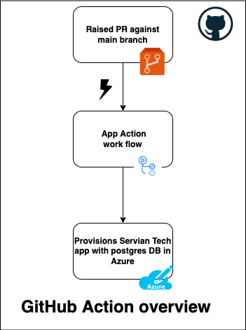
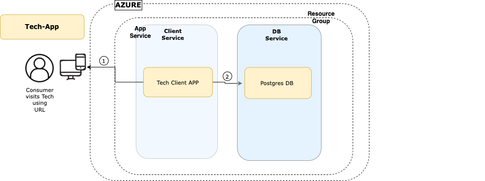

## **Terraform-cloudfoundry-servian-app**

This Terraform root module demonstrates deployment of servian TechChallengeApp to Azure

- Contents of this README:
  1. **What is being provisioned**
  2. **Requirements**
  3. **Providers**
  4. **Modules**
  5. **Resources**
  6. **Inputs**
  7. **High level architectural overview of deployment**
      - *GitHub Action overview*
      - *deployment-overview*. 
  8. **Deployment**
      - *GitHub Actions (Automated Process)*
      - *Manual Deployment*. 
  9. **Technical Challenge URL**
  10. **Contact / Getting help**
  11. **License**
---
## 1. What is being provisioned

- PostgreSQL database
- TechChallengeApp 
---
## 2. Requirements

| Name | Version |
|------|---------|
| <a name="requirement_terraform"></a> [terraform](#requirement\_terraform) | >= 0.14.0 |
| <a name="requirement_cloudfoundry"></a> [cloudfoundry](#requirement\_cloudfoundry) | >= 0.14.2 |
| <a name="requirement_cloudfoundry-Host"></a> [cloudfoundry-Host](#requirement\_cloudfoundry\_host) | n/a |

---
## 3. Providers

| Name | Version |
|------|---------|
| <a name="provider_cloudfoundry"></a> [cloudfoundry](#provider\_cloudfoundry) | >= 0.14.1 |
| <a name="provider_hsdp"></a> [hsdp](#provider\_hsdp) | n/a |

---
## 4. Modules

No modules.

---
## 5. Resources

| Name | Type |
|------|------|
[cloudfoundry_app.servianapp](https://registry.terraform.io/providers/cloudfoundry-community/cloudfoundry/latest/docs/resources/app) | resource |
| [cloudfoundry_service_instance.database](https://registry.terraform.io/providers/cloudfoundry-community/cloudfoundry/latest/docs/resources/service_instance) | resource |
| [cloudfoundry_service_key.database_key](https://registry.terraform.io/providers/cloudfoundry-community/cloudfoundry/latest/docs/resources/service_key) | resource |
| [cloudfoundry_domain.domain](https://registry.terraform.io/providers/cloudfoundry-community/cloudfoundry/latest/docs/data-sources/domain) | data source |
| [cloudfoundry_org.org](https://registry.terraform.io/providers/cloudfoundry-community/cloudfoundry/latest/docs/data-sources/org) | data source |
| [cloudfoundry_service.rds](https://registry.terraform.io/providers/cloudfoundry-community/cloudfoundry/latest/docs/data-sources/service) | data source |
| [hsdp_config.cf](https://registry.terraform.io/providers/philips-software/hsdp/latest/docs/data-sources/config) | data source |

---
## 6. Inputs

| Name | Description | Type | Default | Required |
|------|-------------|------|---------|:--------:|
| <a name="input_cf_api"></a> [cf\_api](#input\_cf\_api) | Cloud foundry API endpoint (region specific) | `string` | `"https://api.cloud.pcftest.com"` | yes |
| <a name="input_cf_app_name"></a> [cf\_app\_name](#input\_cf\_app\_name) | The CF app name | `string` | `"servian-app"` | yes |
| <a name="input_cf_domain_name"></a> [cf\_domain\_name](#input\_cf\_domain\_name) | The CF domain to use for app | `string` | `"cloud.pcftest.com"` | no |
| <a name="input_cf_db_name"></a> [cf\_db\_name](#input\_cf\_domain\_name) | The name of the database | `string` | `"servian-db"` | yes |
| <a name="input_cf_org_name"></a> [cf\_org\_name](#input\_cf\_org\_name) | The CF Org to deploy under | `string` | n/a | yes |
| <a name="input_cf_region"></a> [cf\_app\_region](#input\_cf\_app\_region) | Cloud foundry region | `string` | `"us-east"` | yes |
| <a name="input_cf_space_id"></a> [cf\_space\_id](#input\_cf\_space\_id) | The id of the CF Space to deploy in | `string` | n/a | yes |
| <a name="input_db_broker"></a> [db\_broker](#input\_db\_broker) | The Database broker to use for requesting a PostgreSQL database | `string` | `"hsdp-rds"` | no |
| <a name="input_db_plan"></a> [db\_plan](#input\_db\_plan) | The Database plan to use | `string` | `"postgres-micro-dev"` | no |
| <a name="input_disk"></a> [disk](#input\_disk) | The amount of Disk space to allocate for app (MB) | `number` | `1024` | no |
| <a name="input_docker_image"></a> [docker\_image](#input\_docker_image) | Docker image to use | `string` | `servian/techchallengeapp:latest` | yes |
| <a name="input_listenport"></a> [listenport](#input\_listenport) | The listenport of the app | `number` | `8080` | yes |
| <a name="input_listenhost"></a> [listenhost](#input\_listenhost) | The listenhost of the app | `string` | `0.0.0.0` | yes |
| <a name="input_memory"></a> [memory](#input\_memory) | The amount of RAM to allocate for app (MB) | `number` | `512` | no |

# 7. High level architectural overview of deployment


| *GitHub Action overview* | *deployment-overview* |
|------|------|
|  | 

# 8. Deployment
### GitHub Actions (Automated Process) -- Recommended
- Whenever new code is merged to the main branch then the GitHub action will be triggered automatically.
- On successful build completion, Tech Challange App and postgres DB instance will be provisioned in cloud foundry
- The secret variables are configured in Github
- Full workflow about provisioning Tech Challange App and postgres DB is available in the [servian-app-actions.yml](.github/workflows/servian-app-actions.yml)

### Manual Deployment

### Installing Terraform
Terraform should be installed on your system. [Instructions available here](https://learn.hashicorp.com/tutorials/terraform/install-cli). Once installed check the version, it should be at least `0.14.2` or higher:

```shell
$ terraform version
Terraform v1.0.7
```
### Initalizing Terraform
Next Terraform needs to download the necessary provider plugins, modules and set up the initial (empty) state. Start by executing

```shell
$ terraform init
```
### terraform plan 
Now you are ready to run terraform [plan](https://www.terraform.io/docs/commands/plan.html) with secrets vraiables :

```shell
$ terraform plan -var="cf_org_name=${{secrets.CF_ORG_NAME}}" -var="cf_username=${{secrets.CF_USERNAME}}" -var="cf_password=${{secrets.CF_PASSWORD}}" -var="cf_space_id=${{secrets.CF_SPACE_ID}}" -out=tfplan
```
Terraform will calculate an execution plan and display all the actions it needs to perform to deploy app and components.

### terraform apply
The [apply](https://www.terraform.io/docs/commands/apply.html) step will kick off provisioning of all resources:

```shell
$ terraform apply -auto-approve "tfplan"
```

This typically
takes between 5-15 minutes. The majority of the time is spend waiting on the PostgreSQL database to become available for use.
Once the apply step finishes you should see something like below:

```shell
Apply complete! Resources: 4 added, 0 changed, 0 destroyed..
```
## terraform destroy
You can remove all created resources using the terraform [destroy](https://www.terraform.io/docs/commands/destroy.html) command

```shell
$ terraform destroy
```
# 9. Technical Challenge URL

To Access Technical Challenge URL depolyed in cloud foundry:

```shell
https://techchallenge-app.cloud.pcftest.com/
```
# 10. Contact / Getting help
Please reach me at  [Rajesh Cholleti](mailto:rajesh4277@gmail.com)

# 11. License
[License](./LICENSE.md) is MIT